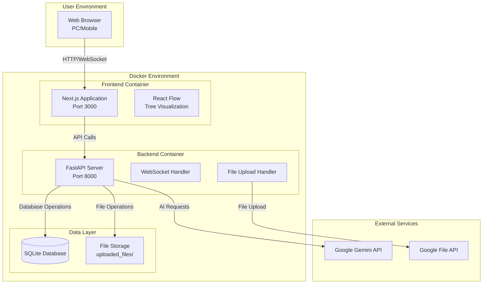

# Design Document

## Overview

The Branching Chat Application is a personal web-based chat interface that enables users to have conversations with Google's Gemini AI while maintaining the ability to branch conversations at any point. The application features a unique tree-based conversation structure, multimodal file support, and real-time streaming responses. The system is designed for local deployment using Docker Compose, ensuring data privacy and user control.

## Architecture

### System Architecture

The application follows a three-tier architecture pattern with clear separation of concerns:



### Container Architecture

The application runs in a Docker Compose environment with the following services:

1. **Frontend Service (Next.js)**
   - Serves the React-based user interface
   - Handles client-side routing and state management
   - Manages WebSocket connections for real-time communication

2. **Backend Service (FastAPI)**
   - Provides REST API endpoints for conversation management
   - Handles WebSocket connections for streaming responses
   - Manages file uploads and Gemini API integration

3. **Data Volume**
   - Persistent SQLite database storage
   - File storage for uploaded documents

## Components and Interfaces

### Frontend Components

#### Core Chat Interface
- **ChatContainer**: Main chat interface component
- **MessageList**: Displays conversation messages with branching indicators
- **MessageInput**: Input component with file attachment support
- **ContextMenu**: Right-click/long-press menu for branching operations

#### Tree Visualization
- **TreeView**: React Flow-based conversation tree visualization
- **TreeNode**: Individual node component representing conversation points
- **TreeControls**: Navigation and zoom controls for tree view

#### Layout Components
- **AppLayout**: Main application layout with responsive design
- **Sidebar**: Navigation between conversations and tree view
- **Header**: Application header with conversation title

### Backend Components

#### API Layer
- **ConversationRouter**: REST endpoints for conversation CRUD operations
- **WebSocketManager**: Handles real-time chat communication
- **FileUploadHandler**: Manages multimodal file processing

#### Business Logic
- **ConversationService**: Core conversation management logic
- **BranchingService**: Handles conversation branching operations
- **GeminiService**: Integration with Google Gemini API
- **SummaryService**: Generates node summaries for tree view

#### Data Access Layer
- **ConversationRepository**: Database operations for conversations
- **MessageRepository**: Database operations for messages
- **FileRepository**: Database operations for file attachments

### Interface Definitions

#### REST API Interfaces

```typescript
// Conversation Management
GET /api/conversations
Response: ConversationSummary[]

GET /api/conversations/{id}
Response: ConversationDetail

PUT /api/conversations/{id}
Body: { title: string }
Response: ConversationSummary

DELETE /api/conversations/{id}
Response: { success: boolean }

// File Upload
POST /api/files/upload
Body: FormData
Response: { gemini_file_uri: string, file_name: string }
```

#### WebSocket Interface

```typescript
// Client to Server
interface ChatMessage {
  type: 'chat_message';
  parent_message_id?: string;
  content: string;
  files?: FileAttachment[];
}

// Server to Client
interface StreamChunk {
  type: 'stream_chunk';
  content: string;
}

interface StreamEnd {
  type: 'stream_end';
  message: MessageData;
}
```

## Data Models

### Database Schema

#### Conversations Table
```sql
CREATE TABLE conversations (
    id INTEGER PRIMARY KEY AUTOINCREMENT,
    title TEXT NOT NULL,
    created_at TIMESTAMP DEFAULT CURRENT_TIMESTAMP,
    updated_at TIMESTAMP DEFAULT CURRENT_TIMESTAMP
);
```

#### Messages Table
```sql
CREATE TABLE messages (
    id INTEGER PRIMARY KEY AUTOINCREMENT,
    conversation_id INTEGER NOT NULL,
    parent_message_id INTEGER,
    role TEXT NOT NULL CHECK (role IN ('user', 'model')),
    content TEXT NOT NULL,
    node_summary TEXT,
    created_at TIMESTAMP DEFAULT CURRENT_TIMESTAMP,
    FOREIGN KEY (conversation_id) REFERENCES conversations(id),
    FOREIGN KEY (parent_message_id) REFERENCES messages(id)
);
```

#### Attached Files Table
```sql
CREATE TABLE attached_files (
    id INTEGER PRIMARY KEY AUTOINCREMENT,
    message_id INTEGER NOT NULL,
    file_name TEXT NOT NULL,
    gemini_file_uri TEXT NOT NULL,
    created_at TIMESTAMP DEFAULT CURRENT_TIMESTAMP,
    FOREIGN KEY (message_id) REFERENCES messages(id)
);
```

### Data Relationships

The core data model supports tree-structured conversations through the `parent_message_id` foreign key in the messages table. This creates a hierarchical structure where:

- Root messages have `parent_message_id = NULL`
- Branched messages reference their parent through `parent_message_id`
- Each message can have multiple children, creating branches
- The tree structure is traversed to build conversation threads

## Error Handling

### Frontend Error Handling

1. **Network Errors**
   - WebSocket connection failures with automatic reconnection
   - API request failures with user-friendly error messages
   - File upload errors with retry mechanisms

2. **User Input Validation**
   - File type and size validation before upload
   - Message content validation
   - Form validation with real-time feedback

3. **State Management Errors**
   - Graceful handling of state inconsistencies
   - Fallback UI states for loading and error conditions

### Backend Error Handling

1. **API Error Responses**
   - Standardized error response format
   - Appropriate HTTP status codes
   - Detailed error messages for debugging

2. **External Service Errors**
   - Gemini API rate limiting and error handling
   - File API upload failures with retry logic
   - Network timeout handling

3. **Database Errors**
   - Transaction rollback on failures
   - Connection pool management
   - Data integrity constraint handling

### Error Response Format

```typescript
interface ErrorResponse {
  error: {
    code: string;
    message: string;
    details?: any;
  };
  timestamp: string;
  request_id: string;
}
```

## Testing Strategy

### Frontend Testing

1. **Unit Tests**
   - Component testing with React Testing Library
   - Hook testing for custom React hooks
   - Utility function testing

2. **Integration Tests**
   - API integration testing with mock servers
   - WebSocket connection testing
   - File upload flow testing

3. **End-to-End Tests**
   - Complete user workflows with Playwright
   - Cross-browser compatibility testing
   - Mobile responsiveness testing

### Backend Testing

1. **Unit Tests**
   - Service layer testing with pytest
   - Repository layer testing with test database
   - Utility function testing

2. **Integration Tests**
   - API endpoint testing with FastAPI TestClient
   - Database integration testing
   - External service mocking (Gemini API)

3. **WebSocket Testing**
   - Real-time communication testing
   - Connection handling testing
   - Message streaming testing

### Test Data Management

- **Test Database**: Separate SQLite database for testing
- **Mock Data**: Predefined conversation and message data
- **File Fixtures**: Sample PDF and image files for testing
- **API Mocking**: Mock responses for Gemini API during testing

### Performance Testing

1. **Load Testing**
   - WebSocket connection limits
   - Concurrent user simulation
   - Database query performance

2. **Memory Testing**
   - Memory usage during long conversations
   - File upload memory management
   - Tree rendering performance

3. **Mobile Performance**
   - Touch interaction responsiveness
   - Mobile network condition testing
   - Battery usage optimization